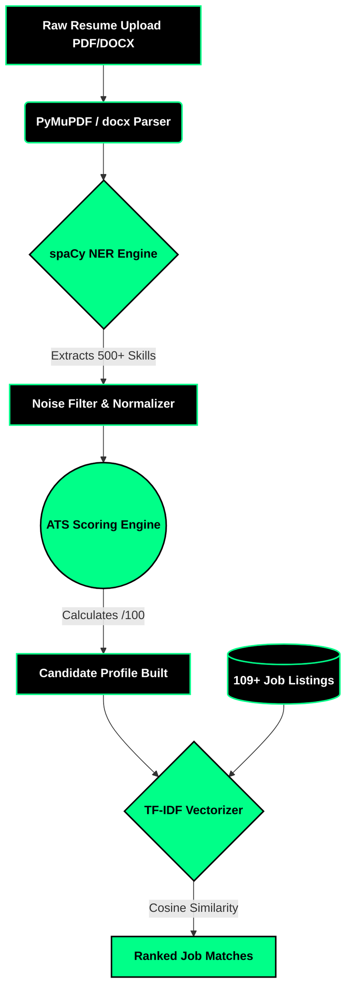

<div align="center">

<!-- Beast Mode Banner -->


<!-- Aggressive Typing Animation -->
<a href="https://github.com/hetvi-prajapati/HireAI_Website">
  
</a>

<br/><br/>

<!-- Premium Dark Badges -->
[](https://python.org)
[](https://flask.palletsprojects.com)
[](https://spacy.io/)
[](https://sqlite.org)
[](https://developer.mozilla.org/en-US/docs/Web/JavaScript)
[](https://owasp.org/)

<br/>

[](LICENSE)
[](https://github.com/hetvi-prajapati/HireAI_Website/stargazers)
[](#)

</div>

<br/>

> **TalentSync** isn't just an ATS. It's a highly aggressive, precision-engineered AI recruitment engine. It rips through resumes, extracts raw skills using custom NLP models, calculates brutal ATS scores, and executes hyper-accurate candidate-to-job matching using Machine Learning. Built for speed, accuracy, and dominance.

---

## 🔥 ARCHITECTURE & PIPELINE



---

## ⚡ LETHAL FEATURES

### 🧠 Custom NLP Skill Extraction
- Driven by a custom-trained **spaCy Named Entity Recognition (NER)** model.
- Aggressive noise-filtering context engine ensures fake/fluff words are ignored.
- Parses deeply nested structures inside PDFs and Word documents instantaneously.

### 💀 Ruthless ATS Scoring
- Every candidate is subjected to a strict algorithm evaluating experience, keyword density, and formatting.
- Instant, unforgiving grade labels: **Excellent**, **Good**, or **Average**.

### 🎯 Hyper-Accurate Job Matching
- Machine Learning powered by **scikit-learn** TF-IDF vectorization.
- Computes multi-dimensional cosine similarity across 109+ real-world tech jobs in milliseconds.
- Outputs ranked arrays of exact match percentages.

### 🛡️ Iron-Clad Security
- **Bcrypt** cryptographic password hashing.
- Brutal rate-limiting (10 strikes/min ban).
- Zero-tolerance parameterized SQL queries.
- Hardened OWASP session cookies (HTTPOnly, SameSite).

---

## 💻 BEAST MODE DASHBOARDS

<div align="center">
  
  <br/><br/>
  <i>The uncompromising split-screen SPA interface. Zero bloat. Pure performance.</i>
</div>

---

## 🛠️ DEPLOYMENT INSTRUCTIONS

Execute the following commands to initialize the engine on your local machine.

```bash
# 1. Clone the repository
git clone https://github.com/hetvi-prajapati/HireAI_Website.git
cd HireAI_Website/AI-Resume-Screening-System

# 2. Install dependencies
pip install -r requirements.txt

# 3. Download base spaCy models
python -m spacy download en_core_web_sm

# 4. Ignite the server
python run.py
```

Access the terminal at `http://127.0.0.1:5000`

---

## 🔑 SYSTEM ACCESS

| Authority Level | Email | Password |
|:---|:---|:---|
| **COMMAND (HR/Admin)** | `admin@talentsync.com` | `admin123` |
| **OPERATIVE (Candidate)** | Register a new identity | — |

---

<div align="center">

<!-- Beast Mode Footer Wave -->


**BUILT WITH PURE CODE & MACHINE LEARNING BY [HETVI PRAJAPATI](https://github.com/hetvi-prajapati)**

[](https://github.com/hetvi-prajapati)

</div>
