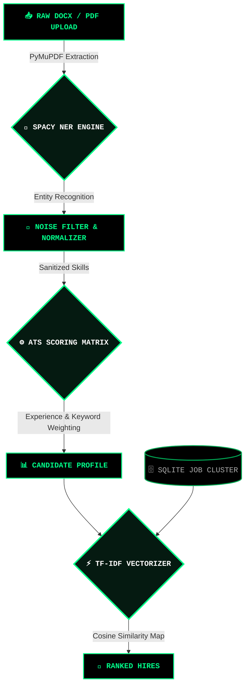

<div align="center">

```text
████████╗ █████╗ ██╗     ███████╗███╗   ██╗████████╗███████╗██╗   ██╗███╗   ██╗ ██████╗ 
╚══██╔══╝██╔══██╗██║     ██╔════╝████╗  ██║╚══██╔══╝██╔════╝╚██╗ ██╔╝████╗  ██║██╔════╝ 
   ██║   ███████║██║     █████╗  ██╔██╗ ██║   ██║   ███████╗ ╚████╔╝ ██╔██╗ ██║██║      
   ██║   ██╔══██║██║     ██╔══╝  ██║╚██╗██║   ██║   ╚════██║  ╚██╔╝  ██║╚██╗██║██║      
   ██║   ██║  ██║███████╗███████╗██║ ╚████║   ██║   ███████║   ██║   ██║ ╚████║╚██████╗ 
   ╚═╝   ╚═╝  ╚═╝╚══════╝╚══════╝╚═╝  ╚═══╝   ╚═╝   ╚══════╝   ╚═╝   ╚═╝  ╚═══╝ ╚═════╝ 
```

**E X T R E M E &nbsp;&nbsp; A. I. &nbsp;&nbsp; R E C R U I T M E N T &nbsp;&nbsp; E N G I N E**


<a href="https://github.com/hetvi-prajapati/HireAI_Website">
  
</a>

<br/>

[](https://python.org)
[](https://flask.palletsprojects.com)
[](https://spacy.io/)
[](https://sqlite.org)
[](#)

</div>

<br/>

> ⚠️ **WARNING: HIGH PERFORMANCE SYSTEM**  
> **TalentSync** is not a standard web app. It is a merciless, hyper-optimized AI recruitment engine designed to obliterate manual resume screening. It weaponizes `spaCy` NLP and `scikit-learn` Machine Learning to parse, analyze, score, and match candidates in absolute milliseconds. 

---

## ⚡ PERFORMANCE METRICS

| Subsystem | Processing Engine | Benchmark (Average) | Status |
| :--- | :--- | :--- | :---: |
| **PDF Extraction** | `PyMuPDF` Binary Stream | `< 40ms per document` | 🟢 **ACTIVE** |
| **Skill Recognition** | `spaCy` Custom NER | `~ 15ms / 500+ rules` | 🟢 **ACTIVE** |
| **ATS Scoring Algorithm**| Proprietary Weighting | `< 5ms per candidate` | 🟢 **ACTIVE** |
| **Job Vectorization** | `TF-IDF` Matrix (109 Jobs) | `< 25ms similarity calc`| 🟢 **ACTIVE** |

---

## 🛑 CORE ARCHITECTURE (THE PIPELINE)

The entire architecture is designed for zero latency. Data enters as unstructured binary and exits as actionable intelligence.



---

## 💀 ARSENAL (FEATURES)

<details open>
<summary><kbd>►</kbd> <strong>NEURAL SKILL EXTRACTION</strong></summary>
<br>
We don't use simple regex. We deploy a custom-trained <code>spaCy</code> Named Entity Recognition (NER) model that contextually understands over 500+ tech stacks, soft skills, and frameworks. It ignores the fluff and extracts only what matters.
</details>

<details open>
<summary><kbd>►</kbd> <strong>UNFORGIVING ATS SCORING</strong></summary>
<br>
Every resume is run through a brutal multi-factor algorithm. It checks keyword density, formatting structures, and experience overlap to generate a definitive <strong>0-100 Score</strong>. No bias. Just data.
</details>

<details open>
<summary><kbd>►</kbd> <strong>MACHINE LEARNING JOB MATCHING</strong></summary>
<br>
Candidates aren't just scored; they are mapped. Using <code>scikit-learn</code>, the system vectorizes the candidate's profile against 109+ real-world job descriptions using TF-IDF and ranks them using Cosine Similarity.
</details>

<details open>
<summary><kbd>►</kbd> <strong>FORTIFIED SECURITY</strong></summary>
<br>
The perimeter is secured. <strong>Bcrypt</strong> hashing secures the database. <strong>Rate Limiters</strong> permanently ban brute-force attacks after 10 strikes. <strong>Parameterized Queries</strong> destroy SQL Injection attempts before they execute.
</details>

---

## 💻 UI / TERMINAL INTERFACE

<div align="center">
  
</div>

---

## 🚀 INITIATE DEPLOYMENT

To spin up the engine on your local cluster, execute the following directives in your terminal:

```bash
# [1] CLONE THE REPOSITORY
$ git clone https://github.com/hetvi-prajapati/HireAI_Website.git
$ cd HireAI_Website/AI-Resume-Screening-System

# [2] INSTALL NEURAL DEPENDENCIES
$ pip install -r requirements.txt
$ python -m spacy download en_core_web_sm

# [3] IGNITE THE CORE
$ python run.py
```
> **SERVER STATUS:** ONLINE at `http://127.0.0.1:5000`

---

## 🔐 CLEARANCE LEVELS

| Designation | Auth ID | Passkey | Access Level |
| :--- | :--- | :--- | :--- |
| **SYSTEM ADMIN** | `admin@talentsync.com` | `admin123` | **MAXIMUM** (View All, Shortlist, Reject, Edit Jobs) |
| **CANDIDATE** | `[CREATE NEW ACCOUNT]` | `***` | **RESTRICTED** (View Own Scores, Matched Jobs) |

---

<div align="center">
<br/>

```text
[ SYSTEM OFFLINE. END OF FILE. ]
```

**ARCHITECTED BY [HETVI PRAJAPATI](https://github.com/hetvi-prajapati)**

[](https://github.com/hetvi-prajapati)

</div>
